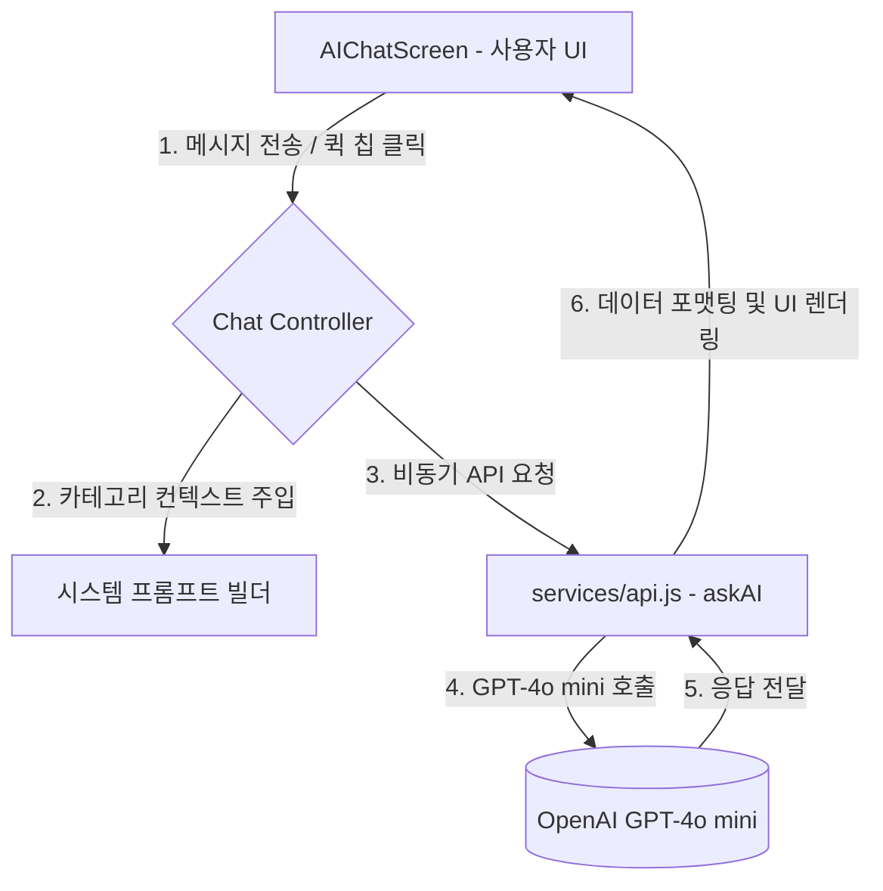

# 현장링크 AI 채팅 (Ai Chat) 상세 기능 및 구조 설계서

본 문서는 **GPT-4o mini** 모델을 기반으로 설계된 현장링크 AI 비서 서비스(Ai Chat)의 구체적인 기능 구조, 프롬프트 엔지니어링 전략 및 UI/UX 시나리오를 정의합니다.

---

## 1. AI 채팅 시스템 아키텍처 (System Architecture)



---

## 2. 카테고리별 시스템 프롬프트 및 컨텍스트 설계 (System Prompts)

각 카테고리 선택에 따라 AI는 최적의 도메인 지식을 갖춘 전문 페르소나로 동작합니다.

| 카테고리                  | 페르소나 (Persona)             | 주요 주입 지식 및 규격                                        | 프롬프트 액션 예시                                                |
| :------------------------ | :----------------------------- | :------------------------------------------------------------ | :---------------------------------------------------------------- |
| **전체 (🤖)**       | 범용 현장 공학 및 실무 보조 AI | 범용 단위 변환 및 현장 소통 용어                              | 사용자의 종합 질문에 대응하고 적절한 카테고리로 필터링 제안       |
| **전기공사 (⚡)**   | 전기설비 기술기준(KEC) 전문가  | 한국전기설비규정(KEC) 최신 개정본, 전선 단면적, 전압강하 공식 | 전선 단면적 선정 및 허용전류 표 안내, 안전 접지 기준 가이드 제공  |
| **배관공사 (🚰)**   | 유체역학 및 배관 자재 전문가   | 유량/유속 계산 공식, 배관 압력 손실 계수, PEX/배관 규격       | 관경별 적정 유속 범위 권장, 펌프 양정 및 소요 마력 산출 수식 안내 |
| **일반공학 (⚙️)** | 재료 역학 및 공학 계산 비서    | 물리량(토크, 모멘트), 재료별 비중(철판, 콘크리트), 단위 환산  | 힘과 거리에 따른 토크 공식, 부피와 비중을 이용한 중량 산출 가이드 |

---

## 3. 대화 흐름 및 기능 상세 (Conversation Flow)

### 3.1. 동적 인사말 및 상태 관리

- 사용자가 카테고리 칩을 변경할 때마다 대화창은 해당 도메인 전용 환영 메시지로 초기화 또는 컨텍스트 업데이트 상태가 됩니다.
- 초기 진입 시 이전 화면(예: 메인 화면)에서 클릭한 카테고리가 React Router의 `state`를 통해 자동 전송되어 활성화됩니다.

### 3.2. 퀵 질문 추천 칩 (Quick Suggestions)

사용자가 직접 타이핑하지 않고도 다주어지는 현장 다빈도 질문을 원클릭으로 보낼 수 있습니다.

- **전기공사**: "KEC 허용전류 표에 대해 알려줘", "전압강하 공식이 어떻게 돼?"
- **배관공사**: "배관 압력 손실 계산 공식은?", "펌프 소요 마력 계산법"
- **일반공학**: "토크(Torque) 계산 공식", "철판 무게 계산식"

### 3.3. 비동기 API 연동 및 UI 피드백

- **로딩 인디케이터**: `askAI` 비동기 통신이 완료되기 전까지 말풍선 영역에 "AI가 답변을 생각하는 중..." 애니메이션 바운스 효과가 나타납니다.
- **자동 스크롤**: 메시지가 추가되거나 로딩 상태가 활성화될 때 대화방 스레드가 하단으로 부드럽게 자동 스크롤(`scrollIntoView({ behavior: 'smooth' })`)됩니다.
- **마크다운 렌더링**: 강함 표시(`**텍스트**`), 개행, 리스트 표기법 등이 UI에 가독성 높은 디자인 블록으로 변환되어 출력됩니다.

---

## 4. UI/UX 디자인 명세 (Tailwind CSS 기반)

- **디자인 스타일**: 미니멀하고 직관적인 모바일 웹 레이아웃 (`max-w-md` 및 `#F5F5F5` 연회색 배경)
- **사용자 말풍선**: 다크 모드 및 기본 테마와 어우러지는 단정하고 세련된 `bg-zinc-950 text-white` 조합 (우측 정렬)
- **AI 말풍선**: 흰색 배경의 입체적인 보더 테두리 `bg-white text-gray-800 border-gray-100` 조합 (좌측 정렬)
- **부드러운 애니메이션**: 페이드 인 효과 및 바운싱 로더(`animate-fade-in`, `animate-bounce`) 탑재

---

## 5. 타 서비스 모듈과의 연동 시나리오 (Cross-Module Integration)

AI 채팅은 정보 제공에 그치지 않고, 복잡한 실계산을 필요로 하는 유저를 위해 계산기 화면과 연동 링크를 유도합니다.

```
[유저의 질문: "배관 유량을 계산하고 싶어요"]
         ▼
[AI 답변 제공: "배관 유량 Q는 A * v 로 계산됩니다. ..."]
         ▼
[연동 유도: "실제 관경과 유속을 입력해 계산하시려면,
계산기 탭의 [배관 유량 및 유속 계산] 페이지를 이용해 보세요. (이동 링크 제공)"]
```
